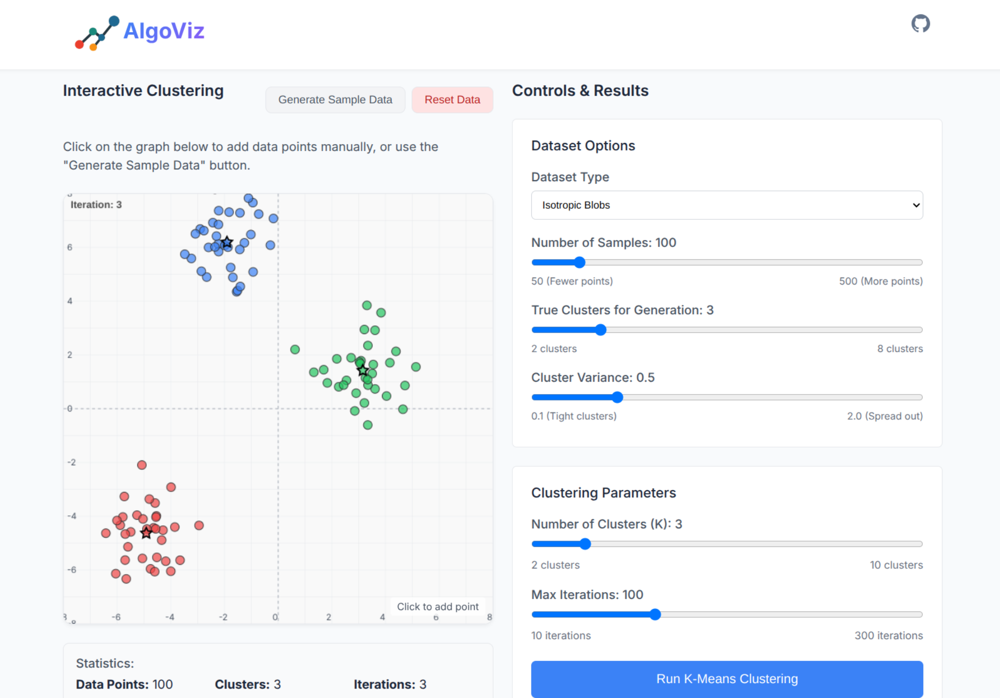

# AlgoViz: Interactive Machine Learning Visualization Platform


An interactive web application for exploring and visualizing machine learning models in real-time. This project allows users to input data, train models, and see visualizations of the algorithms in action.

## 📱 Live Demo

* **Website**: [AlgoViz](https://algovizz.web.app/)


## 🌟 Features

- **Interactive UI** with modern animations using Framer Motion
- **Comprehensive algorithm collection** covering supervised and unsupervised learning
- **Step-by-step algorithm visualization** to understand model behavior
- **Real-time model training** with immediate visual feedback
- **Parameter tuning** to explore how different settings affect model performance
- **Sample data generation** for quick testing and experimentation
- **Responsive design** for optimal viewing on all devices
- **Detailed documentation** with theoretical foundations and practical explanations

## 📊 Implemented Models

### Supervised Learning

#### Linear/Polynomial Regression

- Interactive polynomial curve fitting
- Adjustable polynomial degree and learning rate
- Gradient descent visualization

#### Decision Trees

- Classification and regression trees
- Interactive tree visualization with entropy/gini values
- Adjustable tree depth and split criteria

#### K-Nearest Neighbors (KNN)

- Classification and regression modes
- Adjustable k parameter and distance metrics
- Nearest neighbor highlighting

#### Support Vector Machines (SVM)

- Multiple kernel options
- Support vector visualization
- Margin width adjustment

#### Artificial Neural Networks (ANN)

- Customizable network architecture
- Layer-by-layer visualization
- Training progress monitoring

### Unsupervised Learning

#### K-Means Clustering

- Centroid initialization and movement visualization
- Step-by-step cluster assignment
- Within-cluster variance analysis

#### DBSCAN Clustering

- Density-based clustering animation
- Core/border/noise point visualization
- Epsilon and MinPoints parameter tuning

#### Principal Component Analysis (PCA)

- Data projection and variance explanation
- Eigenvector visualization
- Dimension reduction demonstration

## 🧩 Project Structure

```
AlgoViz/
├── backend/                # Flask backend
│   ├── app.py             # Flask backend entry point
│   ├── models/            # Machine learning model implementations
│   │   ├── Reg.py         # Polynomial regression model
│   │   ├── knn.py         # K-Nearest Neighbors algorithm
│   │   ├── DTrees.py      # Decision Trees algorithm
│   │   ├── SVM.py         # Support Vector Machines algorithm
│   │   ├── ANN.py         # Artificial Neural Network implementation
│   │   ├── kmeans.py      # K-Means clustering algorithm
│   │   ├── dbscan.py      # DBSCAN clustering algorithm
│   │   └── PCA.py         # Principal Component Analysis implementation
│   └── datasets/          # Data generation utilities
│       └── sample_data.py # Sample data generators for each algorithm
├── frontend/              # React frontend
│   ├── public/            # Static assets
│   └── src/               # React source code
│       ├── api/           # API communication layer
│       ├── pages/         # UI components for each algorithm
│       └── components/    # Reusable UI components
└── docs/                  # Documentation and images
    └── images/            # Screenshots and diagrams
```

## 🖼️ Gallery

### Home Page


### Interactive Training Process


## 🚀 Setup Instructions

### Prerequisites
- Node.js (v14+)
- Python (3.8+)
- pip (Python package manager)

### Backend Setup

1. Navigate to the project root directory:
   ```bash
   cd AlgoViz
   ```

2. Install the required Python packages:
   ```bash
   pip install flask flask-cors python-dotenv numpy pandas scikit-learn matplotlib seaborn joblib
   ```

3. Start the Flask backend:
   ```bash
   cd backend
   python app.py
   ```
   The backend will start on http://localhost:5000

### Frontend Setup

1. Navigate to the frontend directory:
   ```bash
   cd AlgoViz/frontend
   ```

2. Install Node.js dependencies:
   ```bash
   npm install
   ```

3. Start the React development server:
   ```bash
   npm start
   ```
   The frontend will be available at http://localhost:3000

## 📖 Usage Guide

### Getting Started

1. Open your browser and navigate to http://localhost:3000
2. Select a machine learning model from the homepage
3. Input your data points manually or load sample data
4. Configure model parameters as needed
5. Run the model to see visualizations and results


### Data Input Methods

- **Click on Canvas**: Add individual data points
- **Sample Datasets**: Choose from pre-configured datasets
- **CSV Upload**: Import your own data (available for some models)

### Visualization Controls

- **Zoom/Pan**: Navigate complex visualizations
- **Play/Pause/Step**: Control algorithm animations
- **Parameter Sliders**: Adjust model settings in real-time
- **Color Legend**: Understand class and cluster representations

## ⚙️ Algorithm-Specific Features

### Linear/Polynomial Regression
- Polynomial degree selection (1-10)
- Learning rate adjustment (0.001-1.0)
- Gradient descent animation with convergence visualization
- Cost history plotting
- R² and MSE evaluation metrics

### Decision Trees
- Classification and regression modes
- Maximum depth control (1-10)
- Split criterion selection (Gini, Entropy, MSE)
- Visual tree structure with node information
- Pruning controls for overfitting prevention

### K-Nearest Neighbors
- Adjustable k parameter (1-20)
- Distance metric selection (Euclidean, Manhattan, Minkowski)
- Decision boundary visualization with confidence shading
- Nearest neighbor highlighting on hover
- Leave-one-out cross-validation option

### Support Vector Machines
- Kernel selection (Linear, RBF, Polynomial, Sigmoid)
- C parameter adjustment for regularization
- Gamma parameter for non-linear kernels
- Support vector highlighting
- Margin width visualization

### Neural Networks
- Layer count adjustment (1-5)
- Neurons per layer configuration
- Activation function selection
- Learning rate and momentum settings
- Loss and accuracy curve plotting during training

### K-Means
- Cluster count selection (2-10)
- Centroid initialization methods (Random, K-Means++)
- Step-by-step cluster assignment animation
- Convergence monitoring
- Elbow method for optimal k visualization

### DBSCAN
- Epsilon (neighborhood radius) adjustment
- MinPoints parameter tuning
- Core/border/noise point identification
- Step-by-step region growing visualization
- Cluster stability analysis across parameters

### PCA
- Component selection interface
- Variance explanation ratio visualization
- Data projection to reduced dimensions
- Original vs. reconstructed data comparison
- Eigenvector and eigenvalue visualization

## ⚠️ Troubleshooting

If you encounter issues:

1. Make sure port 5000 is not in use by another application
2. Check the backend health at http://localhost:5000/api/health
3. For dependency issues, try installing packages one by one:
   ```bash
   pip install flask
   pip install flask-cors
   pip install python-dotenv
   # and so on...
   ```
4. Clear your browser cache if you see stale data
5. Check browser console for JavaScript errors
6. Ensure you have the latest versions of dependencies

## 🔮 Future Enhancements

- Additional machine learning models (random forests, boosting algorithms)
- Dataset preprocessing options
- Batch training for larger datasets
- Model comparison tools
- Exportable trained models
- Advanced visualization options
- User accounts and saved experiments
- Mobile app integration

## 🧪 Technology Stack

- **Frontend**: React.js, Framer Motion, Chart.js
- **Backend**: Flask, Python
- **Machine Learning**: NumPy, scikit-learn, pandas, matplotlib
- **Deployment**: Docker, Google Cloud Run, Firebase

## 👥 Contributors

- [Darsh](https://github.com/darshpatel1052)
- [Bhargav](https://github.com/BhargavShekokar3425) 
- [Priyanshu](https://github.com/Priyanshu-Shah) 
- [Arun](https://github.com/ArunCS1005) 
- [Tanisha](https://github.com/asinat) 
- [Chanchal](https://github.com/ChanchalYadav12) 


## 🙏 Acknowledgements

- [scikit-learn](https://scikit-learn.org/) for machine learning algorithms
- [React](https://reactjs.org/) for the frontend framework
- [Framer Motion](https://www.framer.com/motion/) for smooth animations
- [Flask](https://flask.palletsprojects.com/) for the backend API
